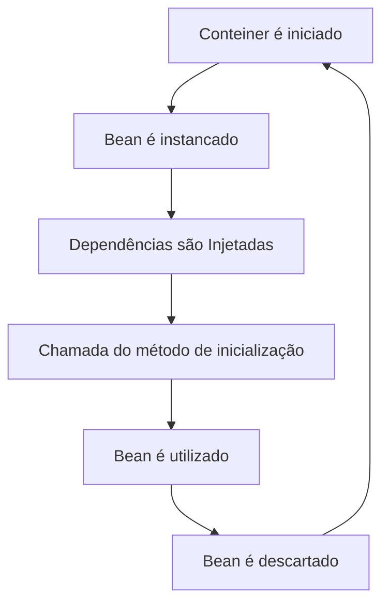

# Spring Boot

## Spring Framework

----

- Plataforma Spring

O que é o Spring?

    Spring nada mais é que uma plataforma com diversos recursos para construção de aplicativos Java, facilitando assim o desenvolvimento em Java EE com módulos que facilitam a construção de _softwares_ reduzindo o tempo de desenvolvimento.

- Beans

    Um bean se trata de um objeto que é instanciado, montado e gerenciado por um container do Spring através de Inversão de Controle(IoC) e Injeção de Dependências (DI).

- Configurando Beans
  
  É possível configurar um Bean de duas  formas por arquivos XML ou através de anotações.
  
  Em XML seria preciso definir a tag<bean> dentro de uma tag princiapal <beans> passando o path da classe assim o Spring saberá quais classes gerenciar a criação de instâncias e a injeção de dependências.

**Bean Factory ou AplicationContext?**

- BeanFactory fornece um mecanismo de configuração avançada capaz de gerenciar objetos de qualquer natureza.

- AplicationContext se baseia na BeanFactory (é uma subinterface ) e adiciona outras funcionalidades, como integração mais fácil com os recursos AOP do Spring, manipulação de recursos de mensagem (para uso na internacionalização), propagação de eventos e contextos específicos da camada de aplicativo, com WebApplicationContext para uso em aplicativos da web.  

- Inversão de Controle
  
  Inversão de Controle (ou IoC - Inversion of Control) é um processo onde se inverte o fluxo de comando de um programa. É uma idea desacoplar ou remover dependências do objeto e fornecer controle para outra camada. Este objeto delega a tarefa de construir dependências para um contêiner IoC.

- Injeção de Dependência
  
  A Injeção de Dependência (ou DI -Dependency Injection) define quais classe serão instanciadas e onde serão injetadas quando for necessário. Existem três formas de aplicar o DI, por injeção de construtor, setter e interface. O Spring Framework aplica a IoC quando necessário também utilizando o DI.

## Spring Boot

----

    O Spring Boot é uma extensão do Spring, que utiliza do Spring Framework para iniciar uma plicação de forma simples e rápida, sem se preocupar com configurações complexas como, por exemplo, o Tomcat

Componentes vase do Spring Boot:

- Spring Boot Starter;

- Spring Boot Auto-Configuration;

- Spring Boot Actuator;

**Como o Spring Boot Funciona ?**

Em resumo o Spring Boot é como um template pré- configurado para desenvolvimento e execução de aplicações baseadas no Spring.

Onde, temos uma arquitetura baseada no Spring Core, que traz os componentes-base do Spring, como o mecanismo de DI/IoC, a Spring Expression Languafe (SpEL) e alguns módulos-base do Spring AOP (módulo para implementação de programação orientada a aspectos no Spring).

- O Spring Boot permite adicionar a estrutura-base o que é chamado de módulo.

- Um módulo é na verdade uma biblioteca ou ferramenta do ecossistema Spring que pode ser adicionada a uma aplicação Spring convencional.

**Moticação do Spring Boot**

Resumidamente o Spring Boot veio para facilitar a vida do desenvolvedor java e melhorar a produtividade do desenvolvimento de softwares. O Spring Boot facilita todo esse processo, fazendo com que o desenvolvedor se concentre mais na parte realmente importante que envolve as regras do negócio e código.

**Spring Initializr**

O Spring Initializr fornece uma API extensível para gerar projetos baseados em JVM (Java Virtual Machine) é onde podemos criar um projeto Spring Boot de forma rápida e fácil, através do site:

## Principais dependências e bibliotecas

- Swagger
  
  Swagger é um projeto open souce com diversas ferramentas utilizadas para desenvolver APIs com a especificação OpenAPI Specification (OAS), uma especificação para descrever, produzir, consumir e visulizar serviços de uma API REST. Com o OAS você poderá descrever recursos, URIs, modelo de dados, métodos HTTP aceitos e códigos de resposta.
  
  Tudo isso facilita a vida dos desenvolvedores de diversas linguafens de programação na criação, testes, consumo e documentação de APIs REST.

- Feign
  
  O Feign é um cliente de serviço web declarativo (cliente HTTP) desenvolvida pela Netflix e um dos mais populares do Spring Cloud Component. Com ele é possível criar clientes API HTTP no Java de forma mais simples para chamar/consumir os serviços REST, utilizando anotações.
  
  Para usar o Feign, precisamos adicionar a dependência **spring-cloud-starter-openfeign** no arquivo pom.xml.

## Spring Boot test

---    

O Spring Boot facilita o desenvolvimento de testes de unidade e integração com o Spring Boot Test, um recurso bastante utilizado no desenvolvimento de aplicações java para testar comportamentos do código e regras do negócio.

Para utilizarmos precisamos usar spring-boot-starter-test, que importa os módulos de teste Spring Boot, bem como JUnit Jupiter, AssertJ, Hamcrest e várias outras bibliotecas úteis.

- Importância do Teste

Em desenvolvimento de software, os erros podem aparecer em qualquer etapa do ciclo de vida do projeto. Com isso, o teste  de software se torna essencial e não pode ser visto como uma atividade opcional, pois garantir a qualidade de qualquer desnvolvimento.

- Testes Unitários
  
  Os testes unitários é a base da pirâmide de testes onde são realizados o maior número de testes ou deveria para garantir a fidelidade do código e regras do negócio.

- @SpringBootTest
  
  A anotação @SpringBootTest é utilizada em uma classe de teste e diz ao Spring Boot para procurar uma classe de configuração principal, por exemplo, o @SpringBootAplication, e usá-la para iniciar um contexto de aplicativo Spring.

        

    

  

            
